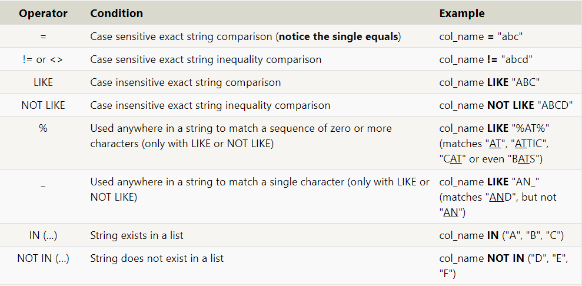

# SQL

**What is SQL?**


SQL, or Structured Query Language, is a language designed to allow both technical and non-technical users query, manipulate, and transform data from a relational database. And due to its simplicity, SQL databases provide safe and scalable storage for millions of websites and mobile applications.


## SELECT queries

To retrieve data from a SQL database, we need to write SELECT statements, which are often colloquially refered to as *queries*.

***Syntax:***

Select query for a specific columns:
```sql
SELECT column, another_column, …
FROM TableNAME;

```

Select query for all columns:
```sql
SELECT * 
FROM TableName;
```

## Queries with constraints

In order to filter certain results from being returned, we need to use a WHERE clause in the query. The clause is applied to each row of data by checking specific column values to determine whether it should be included in the results or not.

***Syntax***
Select query with constraints:
```sql
SELECT column, another_column, …
FROM mytable
WHERE condition
    AND/OR another_condition
    AND/OR …;
```

|Operator	|Condition|	SQL Example|
|--|--|--|
|=, !=, < <=, >, >=|	Standard numerical operators	|col_name != 4|
| BETWEEN … AND …|Number is within range of two values (inclusive)|col_name BETWEEN 1.5 AND 10.5|
|NOT BETWEEN … AND …	|Number is not within range of two values (inclusive)	|col_name NOT BETWEEN 1 AND 10|
|IN (…)|	Number exists in a list	|col_name IN (2, 4, 6)|
|NOT IN (…)	|Number does not exist in a list|	col_name NOT IN (1, 3, 5)|

<hr>

hen writing WHERE clauses with columns containing text data, SQL supports a number of useful operators to do things like case-insensitive string comparison and wildcard pattern matching. We show a few common text-data specific operators below:




## Filtering and sorting Query results

### **Ordering results**
```sql
SELECT column, another_column, …
FROM mytable
WHERE condition(s)
ORDER BY column ASC/DESC;
```
### **Limiting results to a subset**

```sql
SELECT column, another_column, …
FROM mytable
WHERE condition(s)
ORDER BY column ASC/DESC
LIMIT num_limit OFFSET num_offset;
```

