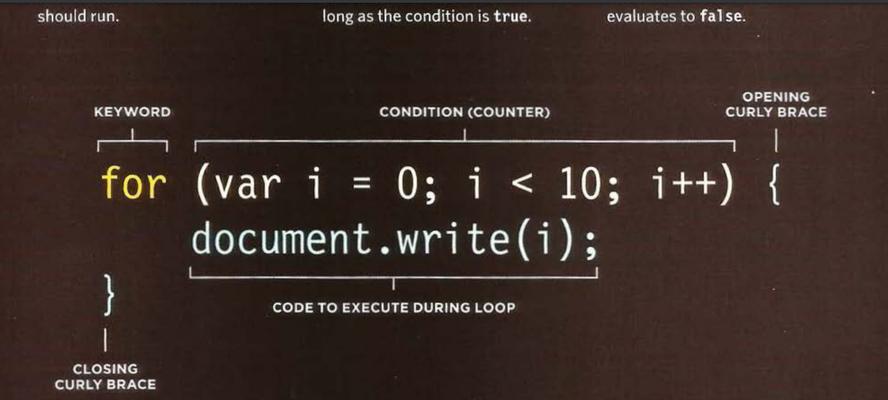

# Operators

## Comparison Operators : Evaluating Conditions

1. **`==`**  is equal to 

2. **`!=`** is not equal to 
3. **`===`**  strict equal to 
4. **`!==`** strict not equal to 
5. **`>`** Greater than 
6. **`<`** Less than
7. **`>=`** Greater than or equal to
8. **`<=`** Less than or equal to

## Logical Operators

1. **`&&`** Logical **AND**
2. **`||`** Logical **OR**
3. **`!`** Logical **NOT**

***
 
 

# Loops

Loops are handy, if you want to run the same code over and over again, each time with a different value.

There are three common type of loops : 

   1. For 
   2. While
   3. Do while

### Syntax of "For Loop"
 

## Loops Counters

A for loop uses a counter as a condition. Yhis instructs the code to run a specified number of times. 

The condition is made up of three statements:
   
   * **Initialization** : creat a variable This variable is commonly called `i` , and it acts as the counter
   `var i = 0 ;`
   *  **Condition** : The loop should continue to run until the counter reaches a specified number
   `i < 10 `

   * **Update** : change the counter value 

   `i++` or `i=i+1`

[Home Page](https://mousasbbah.github.io/reading-notes)