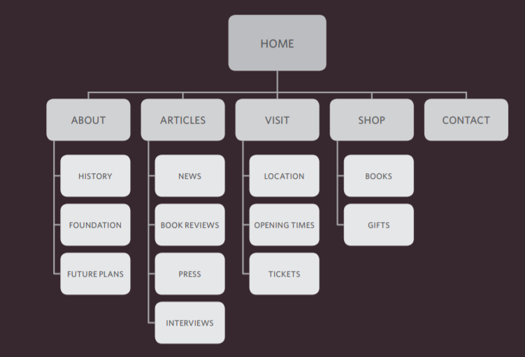

# Process & Design
it can be helpful to ask some
questions about the audience 
such like :
 
 

## Who is the Site For?
individuals or Companies ? , if they are individuals ,What is the age range of your target audience?Will your site appeal to more women or men? What level of education do they have? ... ect. and if they are companies :What is the size of the company or relevant department?How large is the budget they control?What is the position of people in the company who visit your site?

 

## Why People Visit YOUR Website ?

 

## What Your Visitors are Trying to Achieve ?

 

## What Information Your Visitors Need ?

 

## How Often People Will Visit Your Site ?

 

******
 

## Site Maps
The aim is to create a diagram
of the pages that will be used
to structure the site. This is
known as a site map and it will
show how those pages can be
grouped.
To help you decide what
information should go on each
page, you can use a technique
called card sorting

A site map will usually
begin with the homepage.
Additionally, if the site is large
and is compartmentalized
into sections, each section
might require its own section
homepage to link to all of the
information within it.For example :

****
## Wireframe

A wireframe is a simple sketch of the key
information that needs to go on each page of a
site. It shows the hierarchy of the information
and how much space it might require. for example

![wireframe](data:image/png;base64,iVBORw0KGgoAAAANSUhEUgAAAPUAAADOCAMAAADR0rQ5AAAAdVBMVEX///89SFKgpKgsOUUzP0owPUglNECboKQpN0MtO0aPlJjY2tvu7/B5f4VfZ2+8v8Gztrk3RE/DxsjLzc/4+PmIjZNrc3pmbnVNVl9CTVbm5+ggMD25vL+prLBQWWKmqq59g4lXYGjd3uATJzbR09UHIDGLkZZsyo1aAAAGaklEQVR4nO2da7eiIBRAQUGxNz0ss9etbv//Jw6YmlpaejFxOPvDrJWM57IxEDU5CG3dgWFsERoxYhpshPYUmwa1kM+7rsTX4T7adF2HDtigrmvQBUHO+vnLnt/CPWaTdiv0HbLWZFIc2cgkK8nGi+F1YHMepJt4dg9ua4330tobo3n+SPIxWrBHE1yRZLS5/iRfATpeOI//7S+0ZvoYwh7WQhotCtYnsSnRYnOEZidrKcQPsTX1M+XYQ5qzSI92ai2l5xfxRUjFPdsOpVZ4b4EfhHyH2NIttpbSGe2gY6m3DFnRmgjp5Ww6nc4HsfZmLj7tzkkTkWPk58mv+d2a+/dgC9pba56Wze37hkO6xZXtQGdyGkfc4fU6vHeQQDTAYj5CaMV7a70Wm497QeyAA/nBEmbTqBmIha7iu06ckMU78wlCP79XdA57e6zFSUpsDj1K01M0pTSUnT3u1xuETiFlh33Sj2VDTZwr2rKeWJ+frTERw9W2MCtZiSMdH0lsz8QX2tqJZqBZ62FqbXdt9Y758xgeHe1d4cw1QfPH+dibRfueg7R0u/2xd9skmDhfX3Vm+phc5eZmh+J0k+e22JPZfDd+TFs4YxxTlrYg97qeflXyem72Hk49+l9cmBp5zWWuNWFmQaQ1uZ2HJnG+EWFNrY5Po9/GomBtCmBtDmBtDmBtDiZbH7uuxpc5SmvuW65+DG63liJbPpfXXJxqCCGkrdA8utLkOoLbq9f9SnPQdUd7hUXCtkJHV5p6WrvtWQ/AWi9Mtx4ewslWZeg+WI8u8+U0XCoM3Qdr9yb+Wc0Uhu6D9cCVn/YKQ/fBevh7Rlt7pzB0H6zRznFsKn8KpIpeWIsBDa2Yo067J9aCgcOUDeP9sUauulN2j6wVYrK121b4v9CitRtZ39BSO0TVnLZir0h0L6Xrt09ewTF2WoJgbe+bCesWGxRhPp5pyIkTqx2OE67t/fAZbW00O3Ftn33swVotYK0ZYK2Ylb6/NwNrxYC1ZoC1YsBaM8BaMWCtGWCtGLDWDLBWDFhrBlgrBqw1A6wVA9aaAdaKAWvNAGvFgLVmgLViwFozwFoxYK0ZYK0YsNYMsFYMWGsGWCsGrDUDrBUD1poB1ooBa80Aa8WAtWaAtWLAWjPAWjH3Vd0sHd+131Nn1BLjaLVGEmoIbe9d+3i1Rs8s7u/a+zIllTnMo/VIiZbv2rdItPYs0XIMbxELrP/EHgcRWC7INfqJP/jZouC56JgULaqL0CIJr6I3KrNesjipkRgoEHLtOHGMXJTsURTkiqaiKEn9JTOePYpCudclKYoS4SXZTLmK9b6UWY8eWaBQtLzSHVvWP811FWSLvJ3Yy86qrXJ7hdm9MukvR3+vrDrrRwpV1Ko11crayGNd1nll/e2k6LnzhnEROTztdUn2ivp1oGW/RrNNTDQaT+IPY1m0D/5UFCXnXSThVaxLCudrc7hbGzkP5+td14uZfZXdOs4B0fUV71dJckB0nd7zy0TWxF22dYdKS5auvvdIW8Tk7EVgbQJgbQ5gbQ5gbQ5gncMnTdO7OblcDc2zyOFsmK3TNAzx61jzZkupE8yK1s3WTC9YM9ws9yDntazJ4dhkQfIVz1sH3G8Uxy9a81WjOId6x5qsnzd+wMIuWDccNORNngxbZi8axVn3ytoCa7CuCVjngoN1Sqn1m4drH1u/ifOp9btnfYqs14PKP/SxNal+TPep9darTtGmyHrMaFWSx4+tA7apqu/H1qEzOVfEUWXNsVdR38+tMWfrYWmcj60dEedU/iRfnbX4O6XtW8NaxHFK61vDGmPCSjOMKbQW9b2cXhfXshb1/S15nlrLGmMvLBniVVpzVjam1bMmpWNaPWsvKOtz6qy545fmO6xjzcNb6fmgjjWxyx/Aq7Im9uFa+kdqWFe1XR1r7qwqzqWKrH1SmZ34Y2t6qJxsfWz9W9V2yqx31bOhj63fZHb+1Hr0Jo8szMNzwcE6BazrANYSsK5DZ9aNfpg0pQXrZj9wWrpFazptUp1lTWvOG70WRwvPPgJMGsUhuPjsgzaKU+/Zx9pp+As275KzpqxhHEZz1hevYRznRU8ttb7OG5ObvDUPk5t0LZuHeXHRAE9yzQGszQGszQGszQGszQGszQGszQGszQGszQGszcFga/NWGJBvIuPNxCw2GCNiImi/H4zNYrDf/wPzmq51ACFR/QAAAABJRU5ErkJggg==)

****
## Organizing and prioritizing information

Grouping together related
content into blocks or chunks
makes the page look simpler
(and easier to understand).
Users should be able to
identify the purpose of each
block without processing each
individual item.

## Visual hierarchy

Most web users do not read entire pages. Rather, they skim to find
information. You can use contrast to create a visual hierarchy that gets
across your key message and helps users find what they are looking for.

## grouping and Similarity

When making sense of a design, we tend to organize visual elements
into groups. Grouping related pieces of information together can make a
design easier to comprehend. Here are some ways this can be achieved.
## Designing Navigation

Site navigation not only helps people find where they want to go, but also
helps them understand what your site is about and how it is organized.
Good navigation tends to follow these principles...

****
***
# HTML 5 Layout

HTML5 introduces a new set of elements that allow you to divide up the
parts of a page. The names of these elements indicate the kind of content
you will find in them. They are still subject to change, but that has not
stopped many web page authors using them already.

##   Headers & Footers
The `<header>` and `<footer>`
elements can be used for:
   * The main header or footer
that appears at the top or
bottom of every page on the
site.
   * A header or footer for anindividual `<article>` or
`<section>` within the page.

##  Navigation
The `<nav>` element is used to
contain the major navigational
blocks on the site such as the
primary site navigation.

##  Articles
The `<article>` element acts as
a container for any section of a
page that could stand alone and
potentially be syndicated.

##  Article
The <aside> element has two
purposes, depending on whether
it is inside an `<article>`
element or not.
   * When the `<aside>` element
is used inside an `<article>`
element, it should contain
information that is related to the
article but not essential to its
overall meaning. For example, a
pullquote or glossary might be
considered as an aside to the
article it relates to.
   * When the `<aside> `element is
used outside of an `<article>`
element, it acts as a container
for content that is related to
the entire page. For example,
it might contain links to other
sections of the site, a list of
recent posts, a search box, or
recent tweets by the author.

##  Sections
The `<section>` element groups
related content together, and
typically each section would
have its own heading.

##  Heading Groups

The purpose of the `<hgroup>`
element is to group together a
set of one or more `<h1> `through
`<h6>` elements so that they are
treated as one single heading.

## Figures

## Sectioning Elements
the `
` element
will remain an important way to
group together related elements,
because you should not be using
these new elements that you
have just met for purposes other
than those explicitly stated.
Where there is no suitable
element to group a set of
elements, the `
` element will
still be used. In this example, it is
used as a wrapper for the entire
page.

****
# Extra Markup

## DOCTYPES 
Because there have been
several versions of HTML, each
web page should begin with a
DOCTYPE declaration to tell a
browser which version of HTML
the page is using. for html5 we use `<!DOCTYPE html>`

## Comments in HTML
If you want to add a comment
to your code that will not be
visible in the user's browser, you
can add the text between these
characters:

`<!-- comment goes here -->`

## ID Attribute
Every HTML element can carry
the id attribute. It is used to
uniquely identify that element
from other elements on the
page. 

## Class Attribute
Every HTML element can
also carry a class attribute.
Sometimes, rather than uniquely
identifying one element within
a document, you will want a
way to identify several elements
as being different from the
other elements on the page. 

## Grouping Text & Elements In a Block

The `
` element allows you to
group a set of elements together
in one block-level box.
In a browser, the contents of
the `
` element will start on
a new line, but other than this
it will make no difference to the
presentation of the page.
Using an id or class attribute
on the `
` element, however,
means that you can create
CSS style rules to indicate how
much space the `
 `element
should occupy on the screen and
change the appearance of all the
elements contained within it.
 

## Grouping Text & Elements Inline
The `` element acts like
an inline equivalent of the `
`
element. It is used to either:
   1. Contain a section of text
where there is no other suitable
element to differentiate it from
its surrounding text
   2. Contain a number of inline
elements

## IFrames

An iframe is like a little window
that has been cut into your
page — and in that window you
can see another page. The term
iframe is an abbreviation of inline
frame

## 

