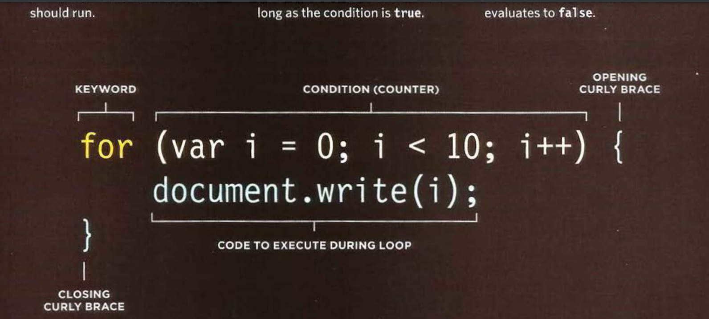

[HOME](https://mousasbbah.github.io/reading-notes/)


# HTML & CSS

## **Lists**

There are lots of occasions when we
need to use lists. HTML provides us with
three different types:
*  Ordered lists are lists where each item in the list is
numbered. For example, the list might be a set of steps for
a recipe that must be performed in order, or a legal contract
where each point needs to be identified by a section
number.

*  Unordered lists are lists that begin with a bullet point
(rather than characters that indicate order).
*  Definition lists are made up of a set of terms along with the
definitions for each of those terms.

### **Ordered Lists**

The ordered list is created with
the `<ol> `element.

Each item in the list is placed
between an opening `<li>` tag
and a closing `</li>` tag. (The li
stands for list item.)

for example :

```html
<ol>
<li>Chop potatoes into quarters</li>
<li>Simmer in salted water for 15-20
minutes until tender</li>
<li>Heat milk, butter and nutmeg</li>
<li>Drain potatoes and mash</li>
<li>Mix in the milk mixture</li>
</ol>
```

### **Unordered Lists**
The unordered list is created
with the `<ul>` element. 

Each item in the `li`st is placed
between an opening `<li>` tag
and a closing `</li>` tag. (The li
stands for list item.)

for example :

```html
<ul>
<li>1kg King Edward potatoes</li>
<li>100ml milk</li>
<li>50g salted butter</li>
<li>Freshly grated nutmeg</li>
<li>Salt and pepper to taste</li>
</ul>
```
### **Definition Lists**

The definition list is created with
the `<dl>` element and usually
consists of a series of terms and
their definitions.
Inside the `<dl>` element you will
usually see pairs of `<dt>` and
`<dd>` elements.

`<dt>`
This is used to contain the term
being defined (the definition
term).

`<dd>`
This is used to contain the
definition.

for example :
```html
<dl>
<dt>Sashimi</dt>
<dd>Sliced raw fish that is served with
condiments such as shredded daikon radish or
ginger root, wasabi and soy sauce</dd>
<dt>Scale</dt>
<dd>A device used to accurately measure the
weight of ingredients</dd>
<dd>A technique by which the scales are removed
from the skin of a fish</dd>
<dt>Scamorze</dt>
<dt>Scamorzo</dt>
<dd>An Italian cheese usually made from whole
cow's milk (although it was traditionally made
from buffalo milk)</dd>
</dl>
```

## **Boxes**


### **Box Dimensions**
By default a box is sized just big
enough to hold its contents. To
set your own dimensions for a
box you can use the **`height`** and
**`width`** properties.

for example: 
```html
<div>
<p>The Moog company pioneered the commercial
manufacture of modular voltage-controlled
analog synthesizer systems in the early
1950s.</p>
</div>
```
```css

div.box {
height: 300px;
width: 300px;
}
p {
height: 75%;
width: 75%;
}

```

### **Limiting Width**

Some page designs expand and
shrink to fit the size of the user's
screen. In such designs, the
**`min-width`** property specifies
the smallest size a box can be
displayed at when the browser
window is narrow, and the
max-width property indicates
the **`maximum width`** a box can
stretch to when the browser
window is wide.

### **Limiting Height**

In the same way that you might
want to limit the width of a box
on a page, you may also want
to limit the height of it. This is
achieved using the **`min-height`**
and **`max-height`** properties.

### **Overflowing Content**
* **`overflow`**
  The overflow property tells the
browser what to do if the content
contained within a box is larger
than the box itself. It can have
one of two values:

   1. `hidden`

       This property simply hides any
extra content that does not fit in
the box.
  2. `scroll`

     This property adds a scrollbar to
the box so that users can scroll
to see the missing content.

### **Border, Margin & Padding**
Every box has three available properties that
can be adjusted to control its appearance:

* **Border**

  Every box has a border (even if
it is not visible or is specified to
be 0 pixels wide). The border
separates the edge of one box
from another.
* **Margin**

  Margins sit outside the edge
of the border. You can set the
width of a margin to create a
gap between the borders of two
adjacent boxes.

* **Padding**

  Padding is the space between
the border of a box and any
content contained within it.
Adding padding can increase the
readability of its contents.


# JAVA script

## SWITCH STATEMENT
A switch statement starts with a 
variable called the switch value. 
Each case indicates a possible 
value for this variable and the 
code that should run if the 
variable matches that value.

 **Syntax of "SWITCH statement"**

 ```js
switch (key) {
    case value:
        
        break;

    default:
        break;
}

 ```


## TRUTHY & FALSY VALUES

**Falsy** values are treated as if they
are false. The following table 
shows a highScore variable with
a series of values, all of which
are falsy.


**Truthy** values are treated as if
they are true. Almost everything
that is not in the falsy table can
be treated as if it were true.
Truthy values can also be treated
as the number 1.


## Loops

Loops are handy, if you want to run the same code over and over again, each time with a different value.

There are three common type of loops : 

   1. For 
   2. While
   3. Do while

### Syntax of "For Loop"
<br>



## Loops Counters

A for loop uses a counter as a condition. This instructs the code to run a specified number of times. 

The condition is made up of three statements:
   
   * **Initialization** : create a variable This variable is commonly called `i` , and it acts as the counter
   `var i = 0 ;`
   *  **Condition** : The loop should continue to run until the counter reaches a specified number
   `i < 10 `

   * **Update** : change the counter value 

      `i++` or `i=i+1`


[HOME](https://mousasbbah.github.io/reading-notes/)
