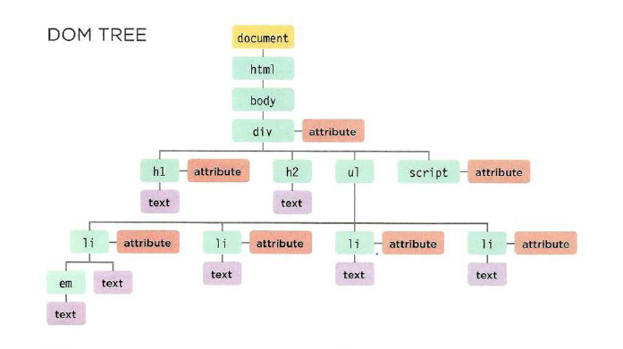

[HOME](https://mousasbbah.github.io/reading-notes/)


# JS Object Literals; The DOM

### WHAT IS AN OBJECT?
Objects group together a set of variables and functions to create a model
of a something you would recognize from the real world. In an object,
variables and functions take on new names.

EXAMPLES

```js
var person = {
  firstName: "John",
  lastName: "Doe",
  age: 50,
  eyeColor: "blue"
};
```
```js
Example
var person = {
  firstName: "John",
  lastName : "Doe",
  id       : 5566,
  fullName : function() {
    return this.firstName + " " + this.lastName;
  }
};
```


## The Document Object Model (**DOM**)
The Document Object Model (DOM) specifies
how browsers should create a model of an HTML
page and how JavaScript can access and update the
contents of a web page while it is in the browser window.
### THE DOM TREE IS A MODEL OF A WEB PAGE

As a browser loads a web page, it creates a model of that page.
The model is called a DOM tree, and it is stored in the browsers' memory.
It consists of four main types of nodes.
<style>
.doc{
    color : yellow ;

}
.elem{color:blue}
.att{color: red}
.text{color:purple}
</style>
<ul>
<li class = "doc"> THE DOCUMENT NODE</li>
<li class = "elem"> ELEMENT NODES</li>
<li class ="att"> ATTRIBUTE NODES</li>
<li class="text"> TEXT NODES</li>
</ul>



## Cashing DOM Queries

Methods that find elements in the DOM tree are called DOM queries. 
When you need to work with an element more than ,once you should 
use a variable to store the result of this query. 

**ACCESSING ELEMENTS**

``getElementByld( ' id ')``


Selects an individual element given the value of its id attribute .
The HTML must have an id attribute in order for it to be selectable.


``querySelector( 'css selector ')``


Uses CSS selector syntax that would select one or more element s .
This method returns only the first of the matching elements.


*METHODS THAT RETURN ONE OR MORE ELEMENTS (AS A NODELIST):*


`getElement sByClassName( 'class ')`

Selects one or more elements given the va lue of their cl ass attribute.
The HTML must have a cl ass attribute for it to be selectable.
This method is faster than querySelectorAaa () .

`getElementsByTagName( ' tagName ')`

Selects all elements on the page with the specified tag name.
This method is faster than querySelectorA11 ().

`querySelectorAll ( ' css selector ')`
Uses CSS selector syntax to select one or more elements and returns all
of those that match.


[HOME](https://mousasbbah.github.io/reading-notes/)